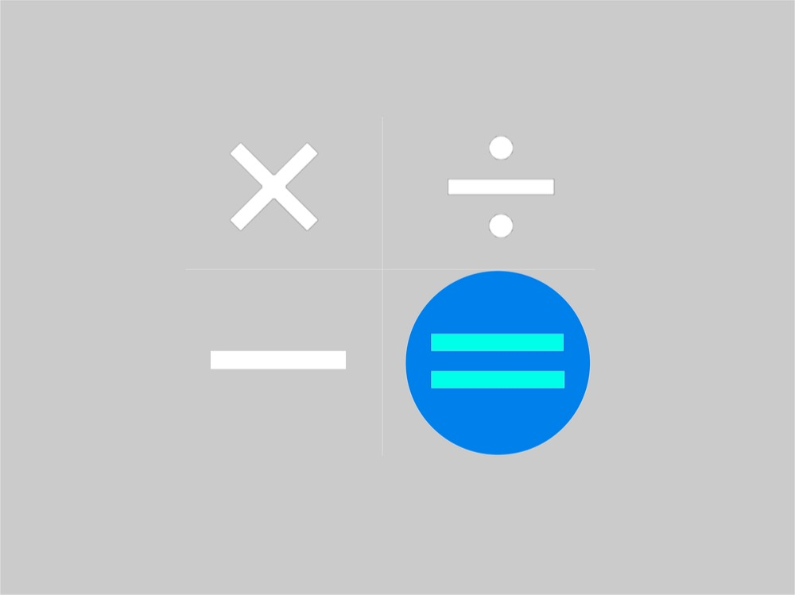
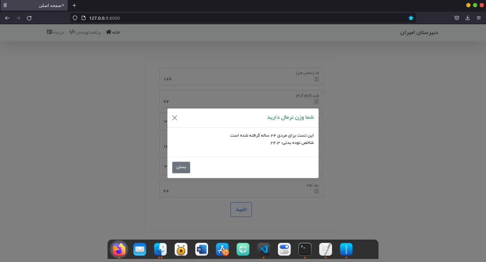

<div id="top"></div>

<!--  -->

<!-- PROJECT SHIELDS -->
<!--
*** I'm using markdown "reference style" links for readability.
*** Reference links are enclosed in brackets [ ] instead of parentheses ( ).
*** See the bottom of this document for the declaration of the reference variables
*** for contributors-url, forks-url, etc. This is an optional, concise syntax you may use.
*** https://www.markdownguide.org/basic-syntax/#reference-style-links
-->
[![Contributors][contributors-shield]][contributors-url]
[![Forks][forks-shield]][forks-url]
[![Stargazers][stars-shield]][stars-url]
[![Issues][issues-shield]][issues-url]
[![MIT License][license-shield]][license-url]


<!-- PROJECT LOGO -->
<br />
<div align="center">
  <a href="https://github.com/othneildrew/Best-README-Template">
    
  </a>

  <h3 align="center">BMI Calculator Website</h3>

  <p align="center">
    یک سایت فارسی برای محاسبات شاخص توده بدنی
    <br />
    <br />
    <a href="https://github.com/othneildrew/Best-README-Template/issues">گزارش باگ</a>
    ·
    <a href="https://github.com/othneildrew/Best-README-Template/issues">درخواست قابلیت</a>
  </p>
</div>


<!-- TABLE OF CONTENTS -->
<details>
  <summary>جدول محتویات</summary>
  <ol>
    <li>
      <a href="#درباره-پروژه">درباره پروژه</a>
      <ul>
        <li><a href="#تکنولوژی-های-استفاده-شده">تکنولوژی های استفاده شده</a></li>
      </ul>
    </li>
    <li>
      <a href="#شروع-کار">شروع کار</a>
      <ul>
        <li><a href="#پیشنیاز-ها">پیشنیاز ها</a></li>
        <li><a href="#نصب-و-راه-اندازی">نصب و راه اندازی</a></li>
      </ul>
    </li>
    <li><a href="#نحوه-استفاده">نحوه استفاده</a></li>
    <li><a href="#مشارکت-در-توسعه">مشارکت در توسعه</a></li>
    <li><a href="#مجوز">مجوز</a></li>
    <li><a href="#حمایت">حمایت</a></li>
    <li><a href="#تشکر-ویژه">تشکر ویژه</a></li>
  </ol>
</details>


<!-- ABOUT THE PROJECT -->
## درباره پروژه

<br>

<p align="right">
این یک پروژه سایت محاسباتی سلامتی بدن برای جشنواره خوارزمی است که از طرف دبیرستان امیران شهر محمدیه استان قزوین و توسط محمدرضا گنج خانی و علیرضا بیدلی ساخته شده است
</p>
<p align="right">(<a href="#top">برگشت به بالای صفحه</a>)</p>


### تکنولوژی های استفاده شده

* [Django](https://docs.djangoproject.com/)
* [DRF](https://docs.django-rest-framework.org/)
* [Gunicorn](https://gunicorn.org/)
* [Bootstrap](https://getbootstrap.com/)
* [Docker](https://docker.com/)
* [Nginx](https://nginx.com)
* [Git](https://git-scm.comd)

<p align="right">(<a href="#top">برگشت به بالای صفحه</a>)</p>


<!-- GETTING STARTED -->
## شروع کار

<p align="right">
برای نصب و راه اندازی این سایت باید این چند مرحله راحت که در زیر نوشته شده را انجام دهید
</p>

### پیشنیاز ها

<p align="right">
تنها پیشنیاز شما نصب نرم افزار داکر و داکی کامپوز است که میتوانید با راهنمایی های <a href="https://docs.docker.com">داکیومنتیشن داکر</a> آن را در سیستم عامل خود نصب و راه اندازی کنید
</p>

### نصب و راه اندازی

1. پروژه را در سیستم عامل خود کلون کنید که در سیستم عامل ویندوز شما میتوانید به راحتی با استفاده از سایت خود گیت هاب این کار را انجام دهید ولی در سیستم عامل های بر پایه لینوکس و مک باید دستور زیر را در خط فرمان خود اجرا کنید
   ```sh
   git clone https://github.com/m0h4mad/BmiWebsite.git
   ```
2. تغییرات خود را در کانفیگ پروژه اعمال کنید
3. و در نهایت با داکر کامپوز پروژه را بالا بیاورید
  ```sh
  docker-compose up
  ```

<p align="right">(<a href="#top">برگشت به بالای صفحه</a>)</p>


<!-- USAGE EXAMPLES -->
## نحوه استفاده

<p align="right">
پس از اجرای پروژه به دامین یا لوکال هاست سیستم خود سر بزنید و از سایت استفاده کنید
</p>

<p align="right">(<a href="#top">برگشت به بالای صفحه</a>)</p>


<!-- CONTRIBUTING -->
## مشارکت در توسعه

<p align="right">
اگر میخواهید در توسعه پروژه مشارکت کنید و قابلیت پیشنهاد بدید یا باگی از پروژه رفع کنید خوشحال میشوم با مراحل زیر این کار را انجام دهید
</p>

1. Fork the Project
2. Create your Feature Branch (`git checkout -b feature/AmazingFeature`)
3. Commit your Changes (`git commit -m 'Add some AmazingFeature'`)
4. Push to the Branch (`git push origin feature/AmazingFeature`)
5. Open a Pull Request

<p align="right">(<a href="#top">برگشت به بالای صفحه</a>)</p>


<!-- LICENSE -->
## مجوز
<p align="right">
این پروژه تحت مجوز (لایسنس) ام آی تی است
برای اطلاعات بیشتر<br>
فایل `LICENSE` را چک کنید
</p>
<p align="right">(<a href="#top">برگشت به بالای صفحه</a>)</p>


<!-- SUPPORT -->
## حمایت

<p align="right">
ممنون میشم اگه خوشتون اومد یه ستاره به این پروژه بدید تا انرژی بگیرم
</p>


<!-- ACKNOWLEDGMENTS -->
## تشکر ویژه

* [Storyset](https://storyset.com)
* [Github](https://github.com)
* [Othneildrew](https://github.com/othneildrew/Best-README-Template)

<p align="right">(<a href="#top">برگشت به بالای صفحه</a>)</p>


<!-- MARKDOWN LINKS & IMAGES -->
<!-- https://www.markdownguide.org/basic-syntax/#reference-style-links -->
[contributors-shield]: https://img.shields.io/github/contributors/m0h4mad/BmiWebsite.svg?style=for-the-badge
[contributors-url]: https://github.com/m0h4mad/BmiWebsite/graphs/contributors
[forks-shield]: https://img.shields.io/github/forks/m0h4mad/BmiWebsite.svg?style=for-the-badge
[forks-url]: https://github.com/m0h4mad/BmiWebsite/network/members
[stars-shield]: https://img.shields.io/github/stars/m0h4mad/BmiWebsite.svg?style=for-the-badge
[stars-url]: https://github.com/m0h4mad/BmiWebsite/stargazers
[issues-shield]: https://img.shields.io/github/issues/m0h4mad/BmiWebsite.svg?style=for-the-badge
[issues-url]: https://github.com/m0h4mad/BmiWebsite/issues
[license-shield]: https://img.shields.io/github/license/m0h4mad/BmiWebsite.svg?style=for-the-badge
[license-url]: https://github.com/m0h4mad/BmiWebsite/blob/master/LICENSE.txt